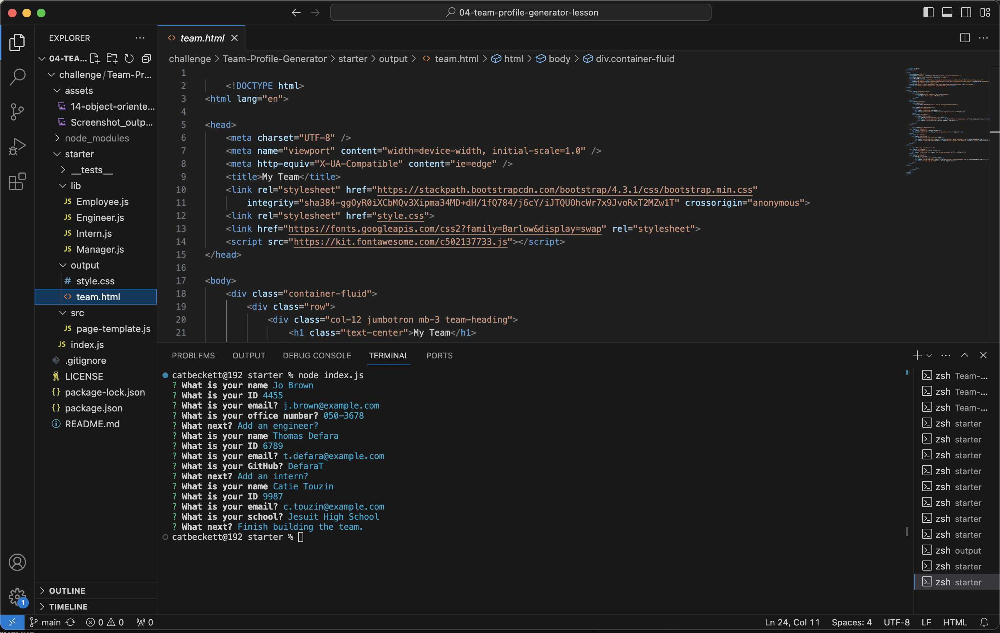
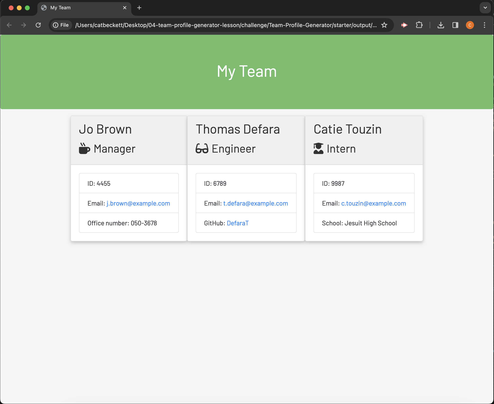

# Team Profile Generator

This is a command-line application built with Node.js that allows users to manage a software engineering team and generate an HTML webpage displaying summaries for each team member.

## Table of Contents

- [Installation](#installation)
- [Usage](#usage)
- [Contributing](#contributing)
- [License](#license)

## Installation

To install the necessary dependencies, run the following command:

`npm install`

## Usage

Clone the repository to your local machine.
Navigate to the project directory in your terminal.
Run the following command to start the application:

`node index.js`

Follow the prompts to enter information about each team member (manager, engineers, interns).
Once you have finished adding team members, the application will generate an HTML file with a summary of your team members in the output directory.

## Contribution

Please feel free to submit a pull request if you would like to contribute to this project.

## License

This project is licensed under the MIT license.

## Screenshot

